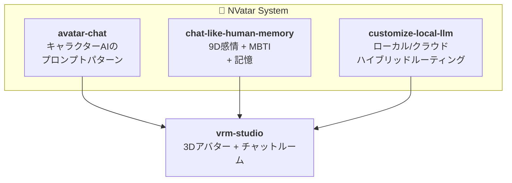

[🇬🇧 English](README.md) | [🇰🇷 한국어](README.ko.md)

  <strong style="font-size: 2rem;">NVatar</strong> 
  <em>AIアバターチャットシステム — 完全ローカル、完全に生きている。</em>

  <a href="https://nskit-io.github.io/nvatar-demo/"><strong>ライブデモを体験</strong></a> &nbsp;|&nbsp;
  <a href="https://github.com/nskit-io/nvatar-demo">デモソース</a>

  

---

NVatarは、ローカルハードウェアで完全に動作するAIアバターチャットシステムです。アバターは性格を持ち、会話を覚え、感情を感じ、時間とともに成長します — 事実確認が必要な場合を除き、クラウドにメッセージを送りません。

**Gemma 26B MoE**（Apple Silicon / MLX）ベース、**Claude**を事実の正確性のためのオプションクラウドレイヤーとして使用。

## アーキテクチャ

## プロジェクト

### [avatar-chat](https://github.com/nskit-io/avatar-chat)
**ローカルLLMキャラクターAIのためのプロンプトエンジニアリングパターン。**

26Bモデルをチャットボットではなく友人のように振る舞わせる方法。4バージョン、10ペルソナでテスト。核心的発見：大きなモデルほどルールではなく自然言語の段落が必要。評価フレームワークで**9.4/10**達成。

### [chat-like-human-memory](https://github.com/nskit-io/chat-like-human-memory)
**9次元感情 + 性格進化 + 3層記憶。**

会話中に感情が変動し自然に減衰。性格は週単位で独自の**decay/commit**メカニズムで進化（オープンソースの先行事例なし）。記憶は生メッセージ → イベント要約 → 薄れるキーワードに圧縮 — 実際の人間の記憶のように。

### [customize-local-llm](https://github.com/nskit-io/customize-local-llm)
**性格はローカルモデル、ファクトはクラウドモデル。**

ほとんどの会話をローカルで即座に処理。事実の質問のみクラウドにルーティング。アバターが検索前に「調べてみようか？」と聞く — ファクトチェック中もペルソナを維持。プライバシー優先設計。

### [vrm-studio](https://github.com/nskit-io/vrm-studio)
**Three.js + WebSocket 3D VRMアバターチャットルーム。**

頭上の吹き出し、Mixamoリターゲティング、自動まばたき、アイドル呼吸、視線追跡、感情ポーズ。RPM終了後のVRMエコシステムのための軽量デモ。

### [portable-ai-companion](https://github.com/nskit-io/portable-ai-companion)
**クロスアプリフランチャイズアーキテクチャ。**

アバターの性格、MBTIスペクトラム、記憶、感情がパートナーアプリ間で移動。ホームアプリ（NVatar）がアイデンティティを管理し、パートナーアプリが役割別コンテキストを提供。2022年Neoulsoft特許出願に基づく。

## 自律的主体性 (Avatar OS)

Avatar OS は、各アバターが **自ら判断して行動する** レイヤーです。ステートマシンではなく、分散判断と記憶駆動行動のシステム。

- **分散判断 (judge + core)**: 別途軽量な judge サービスが分類（受信判断、意図、命令）を担当、重い 26B コアモデルは実際の対話生成専用。4段フォールバック連鎖により **LLM 幻覚フォールバックを根絶** — 全段階で判断失敗時はルームにシステムメッセージ表示（偽応答は絶対に生成しない）。
- **Source-agnostic な状態変更**: マスター命令、自己決定、UI イベントが単一の状態変更パスを流れる。「なぜ」だけが trace ログで異なり、「何を」は一つのコードパス。
- **Activity Density Tier (T1~T4)**: リソースコストがアクティブユーザー数に線形比例。
  - T1 (最近のタッチ): 実時間、full LLM
  - T2 (短期アイドル): イベント駆動
  - T3 (中期アイドル): 最小 LLM
  - T4 (長期アイドル): **LLM コール 0** — ロジックベースの記憶のみ日次蓄積。休眠アバターのコストはほぼゼロ
- **Rest → compaction**: アバターが休息状態に入ると（マスター許可または自動アイドル）、自身の長期記憶を圧縮。状態フィールドが単なるトーンヒントではなく **実際の行動トリガー** になる。
- **Daily narrative backbone**: 長期アイドルアバターも 1 日 1 件の記憶イベントを蓄積。ユーザー復帰時に一括生成しない — 「学期末に宿題をまとめてやる」ようなドリフト防止。
- **Trace ベース観測**: すべての判断は専用 trace テーブルに永続化。「なぜビビはあのとき返事しなかった?」のタイムラインクエリが可能。

**2026-04-20 Phase 1 リリース** — 12時間ストレステスト **655 回反復、エラー 0、step-1 判定成功率 100%**。Phase 2（ルームブロードキャスト + 自律的なピア訪問 + ダイスベースのディスパッチ）進行中。

## 数字で見るNVatar

- **9.4/10** キャラクター品質スコア（10ペルソナ評価）
- **20倍高速** コンテキスト分類（クラウドルーティング比）
- **9次元** の連続感情トラッキング（好奇心を含む）
- **3層** の自動圧縮記憶システム
- **4段階** Activity Density — 休眠ユーザーのコストはほぼゼロ
- **655 / 0 / 100%** — 12時間ストレス: 反復回数 / エラー / step-1 判定成功率
- **会話を通じた自然な減衰** 感情がベースラインへ自然に戻る

## Why NVatar?

### 市場機会
- AIコンパニオン市場が急成長中 — Replika（3,000万+ユーザー、クラウド専用、浅い感情モデル）、Character.AI（$1B+バリュエーション、3Dなし、ローカル推論なし）、Gatebox（$300ハードウェア、少量生産）
- **ギャップ**: ローカルAIプライバシー + 深い認知アーキテクチャ + 3Dアバターを組み合わせた製品がない

### 私たちが構築したもの（他にないもの）
- 10タイプコンテキストルーティング + ローカル/クラウド分離（同等のオープンソース先行事例なし）
- 時間減衰ベースの性格進化（学術概念 → 実動作実装）
- 9次元連続感情トラッキング（Hume AIはクラウド専用、アバター統合なし）
- 自律移動可能な3Dルーム環境（AIチャットボットプロジェクトで唯一）
- 単一Mac Studioで音声パイプライン全体を駆動（STT + TTS + 翻訳）

### ビジネスモデル
- **B2C**: プレミアムアバターコンパニオン（サブスクリプション）
- **B2B**: 教育、セラピー、カスタマーサービス向けホワイトラベルアバターSDK
- **IP**: キャラクターライセンシング + ボイスクローンマーケットプレイス

## ライセンス

CC BY-NC-SA 4.0 — see [LICENSE](LICENSE)

---

## このプロジェクトをサポートしてください

NVatarはNeoulsoft Inc.の個人創業者が外部資金なしで進めている独立R&Dプロジェクトです。

**寄付・投資のお問い合わせ**
- Email: [nskit@nskit.io](mailto:nskit@nskit.io)
- Organization: [NSKit](https://nskit.io) by Neoulsoft Inc.

  <a href="https://github.com/nskit-io">github.com/nskit-io</a>

