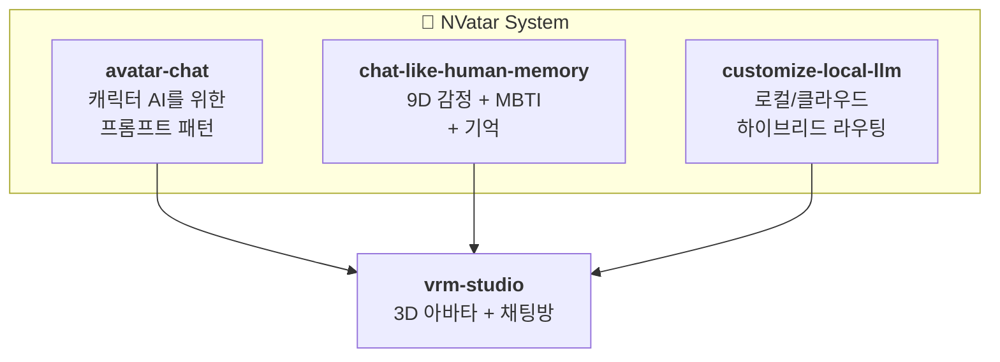

[🇬🇧 English](README.md) | [🇯🇵 日本語](README.ja.md)

  <strong style="font-size: 2rem;">NVatar</strong> 
  <em>AI 아바타 채팅 시스템 — 완전 로컬, 완전히 살아있는.</em>

  <a href="https://nskit-io.github.io/nvatar-demo/"><strong>라이브 데모 체험</strong></a> &nbsp;|&nbsp;
  <a href="https://github.com/nskit-io/nvatar-demo">데모 소스</a>

  

---

NVatar는 로컬 하드웨어에서 완전히 구동되는 AI 아바타 채팅 시스템입니다. 아바타는 성격을 갖고, 대화를 기억하고, 감정을 느끼고, 시간이 지나면서 성장합니다 — 사실 확인이 필요한 경우를 제외하면 클라우드에 메시지를 보내지 않습니다.

**Gemma 26B MoE** (Apple Silicon / MLX) 기반, **Claude**를 사실 정확성을 위한 선택적 클라우드 레이어로 사용.

## 아키텍처

## 프로젝트

### [avatar-chat](https://github.com/nskit-io/avatar-chat)
**로컬 LLM 캐릭터 AI를 위한 프롬프트 엔지니어링 패턴.**

26B 모델을 챗봇이 아닌 친구처럼 행동하게 만드는 방법. 4개 버전, 10개 페르소나 테스트. 핵심 발견: 큰 모델일수록 규칙이 아닌 자연어 문단이 필요. 평가 프레임워크에서 **9.4/10** 달성.

### [chat-like-human-memory](https://github.com/nskit-io/chat-like-human-memory)
**9차원 감정 + 성격 진화 + 3단계 기억.**

대화 중 감정이 변동하고 자연스럽게 감쇄. 성격은 주 단위로 독창적인 **decay/commit** 메커니즘으로 진화 (오픈소스 선례 없음). 기억은 원본 → 이벤트 요약 → 흐릿한 키워드로 압축 — 실제 사람의 기억처럼.

### [customize-local-llm](https://github.com/nskit-io/customize-local-llm)
**성격은 로컬 모델, 팩트는 클라우드 모델.**

대부분의 대화를 로컬에서 즉각 처리. 사실 질문만 클라우드로 라우팅. 아바타가 검색 전 "찾아볼까?" 물어봄 — 팩트 체크 중에도 페르소나 유지. 프라이버시 우선 설계.

### [vrm-studio](https://github.com/nskit-io/vrm-studio)
**Three.js + WebSocket 3D VRM 아바타 채팅방.**

머리 위 말풍선, Mixamo 리타겟팅, 자동 눈깜빡임, 유휴 호흡, 시선 추적, 감정 포즈. RPM 종료 후 VRM 생태계를 위한 경량 데모.

### [portable-ai-companion](https://github.com/nskit-io/portable-ai-companion)
**크로스앱 프랜차이즈 아키텍처.**

아바타의 성격, MBTI 스펙트럼, 기억, 감정이 파트너 앱 간 이동. 홈 앱(NVatar)이 정체성을 관리하고, 파트너 앱은 역할별 컨텍스트를 제공. 2022년 너울소프트 특허 출원 기반.

## 자율 주체성 (Avatar OS)

Avatar OS 는 아바타가 **스스로 판단하고 행동하는** 레이어입니다. 상태 기계가 아니라 분산 판단과 기억 기반 행동 시스템.

- **분산 판단 (judge + core)**: 별도 `nvatar-judge` 서버가 분류 작업 (수신 판단, 명령 인식) 담당, 무거운 26B 코어 모델은 실제 대화 생성에만 사용. 4단 폴백 체인으로 **LLM 환각 폴백을 원천 차단** — 판단 실패 시 룸에 시스템 메시지 표시 (가짜 응답 절대 안 만듦).
- **Source-agnostic 상태 변경**: 마스터 명령, 자율 결정, UI 이벤트 모두 `apply_state_change(source)` 단일 경로. "왜" 만 trace 에 남고 "무엇" 은 하나의 코드 경로로 통일 — Phase 1.3 (명령) ↔ 1.4 (자율성) 자연 결합.
- **Activity Density Tier (T1~T4)**: 리소스 비용이 active user 수에 선형 비례.
  - T1 (0~1일 터치): 실시간, full LLM
  - T2 (1~3일): 이벤트 기반
  - T3 (3~7일): 최소 LLM
  - T4 (7일+): **LLM 콜 0** — 로직 기반 기억만 매일 축적. 휴면 아바타는 비용이 거의 제로
- **Rest → compaction**: 아바타가 쉬는 상태 진입 시 (마스터 허락 or 자동 idle) **스스로** 장기 기억 정리. 상태 필드가 단순 톤 힌트가 아닌 **실제 행동 트리거**.
- **Daily narrative backbone**: T4 아바타도 매일 L2 기억 이벤트 1건 축적. 사용자 복귀 시 몰아서 생성하지 않음 — "방학 숙제 몰아 하는" 실수 방지.
- **Trace 기반 관측**: 모든 판단은 `nv_os_trace` + `nv_os_decision` + `nv_os_response` 에 기록. "왜 비비가 그때 대답 안 했지?" 타임라인 조회 가능.

**2026-04-20 Phase 1 출시** — 12시간 스트레스 테스트 **655회 반복, 에러 0건, step-1 판단 성공률 100%**. Phase 2 (룸 브로드캐스트 + 자율 친구 방문 + 주사위 선점) 진행 중.

## 숫자로 보는 NVatar

- **9.4/10** 캐릭터 품질 점수 (10인 페르소나 평가)
- **20배 빠른** 컨텍스트 분류 (클라우드 라우팅 대비)
- **9차원** 연속 감정 추적 (호기심 포함)
- **3단계** 기억 시스템 (rest 상태 진입 시 자동 압축)
- **4단계** Activity Density — 휴면 사용자 비용 거의 0
- **655 / 0 / 100%** — 12시간 스트레스: 반복 횟수 / 에러 / step-1 판단 성공률
- **대화에 걸친 자연 감쇄** 감정이 기준선으로 자연스럽게 복귀

## Why NVatar?

### 시장 기회
- AI 컴패니언 시장이 급성장 중 — Replika (3천만+ 유저, 클라우드 전용, 얕은 감정 모델), Character.AI ($1B+ 밸류에이션, 3D 없음, 로컬 추론 없음), Gatebox ($300 하드웨어, 소량 생산)
- **공백**: 로컬 AI 프라이버시 + 깊은 인지 아키텍처 + 3D 아바타를 결합한 제품이 없음

### 우리가 만든 것 (그리고 다른 곳에 없는 것)
- 10타입 컨텍스트 라우팅 + 로컬/클라우드 분리 (동일 오픈소스 선례 없음)
- 시간 감쇄 기반 성격 진화 (학술 개념 → 실동작 구현)
- 9차원 연속 감정 추적 (Hume AI는 클라우드 전용, 아바타 통합 없음)
- 자율 이동 가능한 3D 룸 환경 (AI 챗봇 프로젝트 중 유일)
- 단일 Mac Studio에서 음성 파이프라인 전체 구동 (STT + TTS + 번역)

### 비즈니스 모델
- **B2C**: 프리미엄 아바타 컴패니언 (구독)
- **B2B**: 교육, 테라피, 고객 서비스용 화이트라벨 아바타 SDK
- **IP**: 캐릭터 라이선싱 + 보이스 클론 마켓플레이스

## 라이선스

CC BY-NC-SA 4.0 — see [LICENSE](LICENSE)

---

## 이 프로젝트를 지원해주세요

NVatar는 Neoulsoft Inc.의 1인 대표가 외부 투자 없이 진행하는 독립 R&D 프로젝트입니다.

**후원 및 투자 문의**
- Email: [nskit@nskit.io](mailto:nskit@nskit.io)
- Organization: [NSKit](https://nskit.io) by Neoulsoft Inc.

  <a href="https://github.com/nskit-io">github.com/nskit-io</a>

