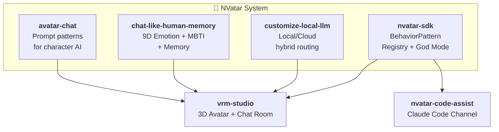

[🇰🇷 한국어](README.ko.md) | [🇯🇵 日本語](README.ja.md)

  <strong style="font-size: 2rem;">NVatar</strong> 
  <em>AI Avatar Chat System — fully local, fully alive.</em>

  <a href="https://nskit-io.github.io/nvatar-demo/"><strong>Try Live Demo</strong></a> &nbsp;|&nbsp;
  <a href="https://github.com/nskit-io/nvatar-demo">Demo Source</a>

  

---

NVatar is an AI avatar chat system that runs entirely on local hardware. Your avatar has a personality, remembers your conversations, feels emotions, and grows over time — all without sending a single message to the cloud (unless it needs to look up a fact).

Built on **Gemma 26B MoE** (Apple Silicon / MLX), with **Claude** as an optional cloud layer for factual accuracy.

## Architecture

## Projects

### [avatar-chat](https://github.com/nskit-io/avatar-chat)
**Prompt engineering patterns for local LLM character AI.**

How do you make a 26B model behave like a friend, not a chatbot? We tested across 4 versions and 10 personas. Key discovery: larger models need natural language paragraphs, not rule lists. Scored **9.4/10** on our evaluation framework.

### [chat-like-human-memory](https://github.com/nskit-io/chat-like-human-memory)
**9D emotion + personality evolution + 3-tier memory.**

Your avatar's emotions shift during conversation and decay naturally. Personality evolves over weeks through a novel **decay/commit** mechanism (no prior art in open source). Memory compacts from raw messages → event summaries → fading keywords — like real human memory.

### [customize-local-llm](https://github.com/nskit-io/customize-local-llm)
**Local model for personality, cloud model for facts.**

Most conversations are handled locally with sub-second latency. Only factual questions route to the cloud. The avatar asks "Want me to look that up?" before searching — maintaining its persona even during fact-checking. Privacy-first by design.

### [vrm-studio](https://github.com/nskit-io/vrm-studio)
**3D VRM avatar chat room with Three.js + WebSocket.**

Multi-avatar virtual room with speech bubbles floating above heads, Mixamo animation retargeting, auto-blink, idle breathing, eye tracking, and emotion poses. A lightweight post-RPM demo for the VRM ecosystem.

### [nvatar-sdk](https://github.com/nskit-io/nvatar-sdk)
**BehaviorPattern SDK — pluggable avatar behaviors.**

Build custom patterns that extend your avatar's capabilities without touching its personality. Your avatar can be a code assistant, language tutor, or therapist — each behavior runs independently with isolated **Franchise Memory**, while the avatar's core identity stays intact. Includes God Mode (context routing + user profiling), **PeerInteractionPattern** (avatar↔avatar autonomy via 10s dice dispatcher with intimacy-aware tone), and a 3-layer multilingual stability stack (SessionState + dynamic directive + langdetect output filter, ko/ja/en/zh).

### [nvatar-code-assist](https://github.com/nskit-io/nvatar-code-assist)
**Claude Code integration via MCP channel.**

The first SDK pattern — relay code commands through the avatar to Claude Code sessions. Progress updates stream back as avatar speech. Built on the BehaviorPattern Registry with full channel lifecycle management.

### [portable-ai-companion](https://github.com/nskit-io/portable-ai-companion)
**Cross-app franchise architecture.**

Your avatar's personality, MBTI spectrum, memory, and emotions move between partner apps. Home app (NVatar) manages identity; partner apps provide context-specific roles. Based on 2022 patent applications by Neoulsoft Inc.

## Autonomous Agency (Avatar OS)

Avatar OS is the layer that makes each avatar **act on its own** — not a state machine, but a decision system with distributed judgment and memory-driven behavior.

- **Distributed judgment (judge + core)**: A separate lightweight judge service handles classification (receipt, intent, command) while the core 26B model is reserved for actual dialogue generation. A four-stage fallback chain prevents hallucinated fallbacks — if judgment fails at every level, the room shows a system message instead of a garbage reply.
- **Source-agnostic state changes**: Master commands, self-decisions, and UI events flow through a single state-change path. Only the "why" differs in trace logs; the "what" is one code path.
- **Activity Density Tiers (T1~T4)**: Resource cost scales linearly with active users.
  - T1 (recent touch): full-tick, full LLM
  - T2 (short idle): event-driven
  - T3 (medium idle): minimal
  - T4 (long idle): **LLM-free** logic-based memory accrual — dormant avatars cost essentially nothing
- **Rest → compaction**: When an avatar enters rest state (master-permitted or auto-idle), it compacts its own long-term memory. A state field becomes an actual behavior trigger, not just a tone hint.
- **Daily narrative backbone**: Even long-idle avatars accumulate one memory event per day — not batch-generated at user return, so there's no "cramming the semester's worth of homework at once" drift.
- **Trace-based observability**: Every decision is persisted to dedicated trace tables. Full timeline query answers "why didn't Vivi respond?" for any message.

Phase 1 shipped **2026-04-20** — 12-hour stress test with **655 iterations, zero errors, 100% step-1 success**. Phase 2 (room broadcast + autonomous peer visits + dice-based dispatch) in progress.

## The Stack

| Layer | Technology |
|-------|-----------|
| Local LLM | Gemma 4 26B MoE (MLX on Apple Silicon) |
| Cloud LLM | Claude via [CSW](https://github.com/nskit-io/csw) |
| 3D Avatar | Three.js + @pixiv/three-vrm |
| Animation | Mixamo FBX retargeting |
| Real-time | WebSocket |
| Speech | Whisper STT (MLX) + ElevenLabs TTS |

## Numbers

- **9.4/10** character quality score (10-persona evaluation)
- **20x faster** context classification vs cloud routing
- **9 dimensions** of continuous emotion tracking (including curiosity)
- **3 tiers** of memory with automatic rest-triggered compaction
- **4 tiers** of activity density — dormant-user cost near zero
- **655 / 0 / 100%** — 12-hour stress: iterations / errors / step-1 judgment success
- **Natural decay** of emotions over conversation toward baseline

## Why NVatar?

### Market Opportunity
- AI companion market is rapidly growing — Replika (30M+ users, cloud-only, shallow emotion models), Character.AI ($1B+ valuation, no 3D or local inference), Gatebox ($300 hardware, limited production)
- **The gap**: No product combines local AI privacy + deep cognitive architecture + 3D avatar presence

### What We've Built (and What Others Haven't)
- 10-type context routing with local/cloud split (no documented open-source equivalent)
- Personality evolution with time-decay commit cycle (academic concept → working implementation)
- 9-dimensional continuous emotion tracking (Hume AI is cloud-only, no avatar integration)
- 3D room environment with autonomous avatar movement (no AI chatbot project has this)
- Full voice pipeline (STT + TTS + translation) on a single Mac Studio

### Business Models
- **B2C**: Premium avatar companions (subscription)
- **B2B**: White-label avatar SDK for education, therapy, customer service
- **IP**: Character licensing + voice clone marketplace

## License

CC BY-NC-SA 4.0 — see [LICENSE](LICENSE)

---

## Support This Project

NVatar is built by a solo founder at Neoulsoft Inc. — independent R&D, no external funding yet.

If you find this work valuable:

**Donation & Investment Inquiry**
- Email: [nskit@nskit.io](mailto:nskit@nskit.io)
- Organization: [NSKit](https://nskit.io) by Neoulsoft Inc.

  <a href="https://github.com/nskit-io">github.com/nskit-io</a>

